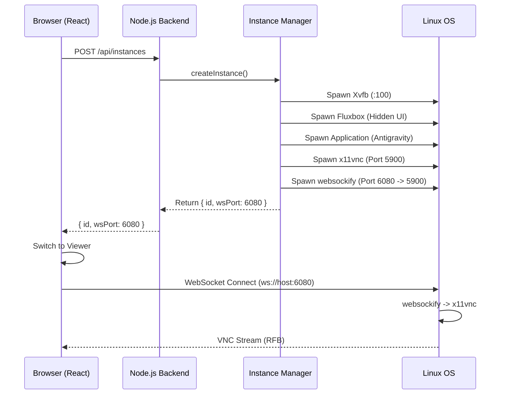

# Antigravity RDP Architecture

## Overview
Antigravity RDP is a system designed to provide web-based remote access to isolated desktop applications running on a Linux server. It leverages standard X11 technologies combined with modern web protocols to deliver a seamless, app-like experience in the browser.

## System Components

### 1. The Backend (`server/`)
The backend is a Node.js application using Express. It acts as the orchestrator for all sessions.

-   **API Layer**: Exposes REST endpoints to list, create, and delete instances.
-   **Instance Manager**: The core logic class responsible for:
    -   **Resource Allocation**: Assigns unique Display IDs (e.g., `:100`) and ports (VNC: `5900+`, WebSocket: `6080+`) using a monotonic counter to prevent race conditions.
    -   **Process Management**: Spawns and monitors the lifecycle of the display stack processes.
    -   **Isolation**: Creates temporary user data directories (`/tmp/antigravity-<id>`) for each instance to ensure clean sessions and prevent data leakage between concurrent users.
    -   **Cleanup**: Automatically terminates all associated processes and removes temporary files when the main application exits or the instance is manually terminated.

### 2. The Display Stack
For each session, the following process chain is created:

1.  **Xvfb (X Virtual Framebuffer)**:
    -   Creates a virtual X11 display in memory without requiring a physical screen.
    -   Resolution is set to `1280x720` (configurable).
2.  **Fluxbox (Window Manager)**:
    -   Manages windows within the Xvfb display.
    -   Configured with a custom `init` file to hide toolbars and decorations, maximizing the "native app" feel.
3.  **Application (Antigravity/xterm)**:
    -   The target application runs on the specific X display (`DISPLAY=:100`).
    -   Launched with specific flags (e.g., `--user-data-dir`) to ensure it treats the session as a fresh instance.
4.  **x11vnc**:
    -   Captures the Xvfb framebuffer and exposes it via the RFB (VNC) protocol on a TCP port (e.g., `5900`).
5.  **websockify**:
    -   Bridges the TCP VNC traffic to WebSockets (e.g., port `6080`), allowing the browser to connect.

### 3. The Frontend (`client/`)
A React application built with Vite that serves as the user interface.

-   **Landing Page**: Checks for existing sessions in `localStorage` to allow quick resumption.
-   **Instance List**: Displays active sessions with real-time updates (polling).
-   **Viewer**:
    -   Uses `react-vnc` (based on `noVNC`) to render the remote display.
    -   Connects via WebSocket (`ws://server:port`) to the `websockify` instance.
    -   Renders in **Full Screen** mode with minimal UI to emulate a local application.

## Data Flow



## Security & Network
-   **Tailscale**: The system is designed to run over a Tailscale VPN, providing secure, private access without exposing ports to the public internet.
-   **Isolation**: Each instance runs as the host user but uses separate temporary directories for application state, preventing conflicts.
-   **Traffic**: VNC traffic is unencrypted by default (standard VNC), but security is provided by the VPN tunnel (Tailscale).

## Directory Structure
```
antigravityRDP/
├── server/
│   ├── index.js           # API Entry point
│   └── instanceManager.js # Process orchestration
├── client/
│   ├── src/
│   │   ├── components/    # React components (Viewer, List, Landing)
│   │   └── App.jsx        # Main routing logic
│   └── vite.config.js
├── .env                   # Configuration
└── README.md              # Usage guide
```
